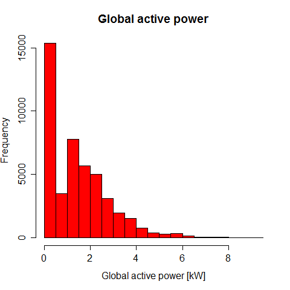
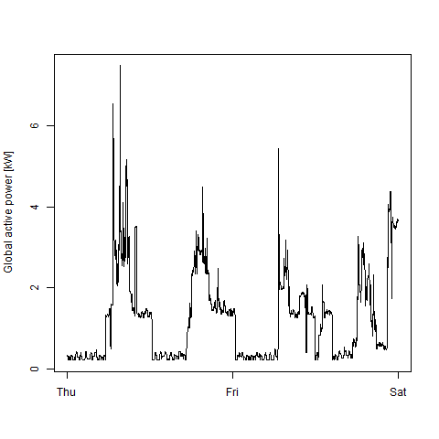
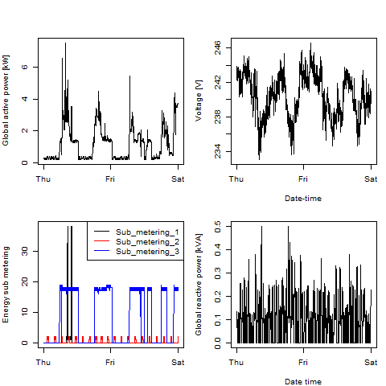

## Introduction

This assignment uses data from
the <a href="http://archive.ics.uci.edu/ml/">UC Irvine Machine
Learning Repository</a>, a popular repository for machine learning
datasets. In particular, we will be using the "Individual household
electric power consumption Data Set" which I have made available on
the course web site:

## What's in it
Below list of files and scripts required:
* `getdata.R` this mainly extracts and transforms the data, I source it for all others
* `plot1-4 .R` and `plot1-4.jpg` the actual deliverables

### Modifications for peer review
I have modified the readme file so to show the resulting graphics, as a way to ease peer review. Please note you still should check R code (I still don't know how to paste r code)

## Results
Below you may see te resulting plots for the assignment

### Plot 1

 

### Plot 2

 

### Plot 3

 

### Plot 4

 

